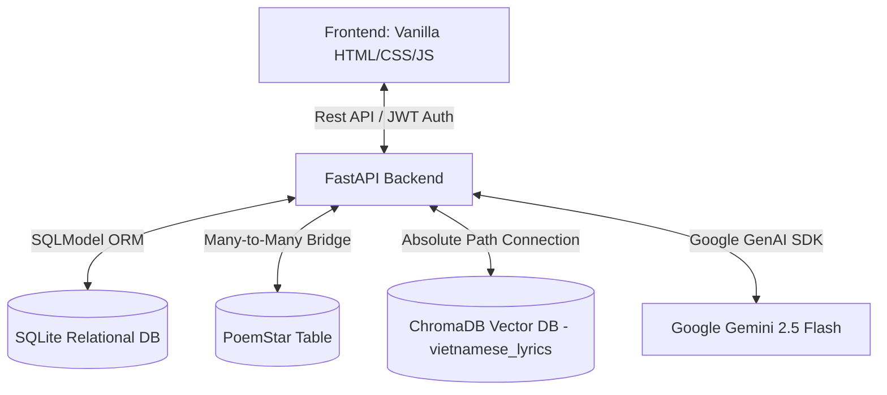

# GieoVần - Mạng xã hội Thơ ca & Rap Lyrics tích hợp Trợ lý AI

> **English Version Notice:** Scroll down to the bottom half of this document to read the English documentation.

---

## 📝 1. Tổng quan dự án

**GieoVần** không chỉ dừng lại ở một công cụ gieo vần hay hỗ trợ tìm kiếm âm tiết đơn thuần. Nền tảng đã chính thức tiến hóa thành một **Mạng xã hội Thơ ca & Rap Lyrics hoàn chỉnh**, nơi các nghệ sĩ và nhà thơ có thể kết nối tâm hồn, tự do sáng tạo tác phẩm dưới sự trợ lực đắc lực của mô hình ngôn ngữ lớn (Gemini 2.5) và cơ sở dữ liệu vector ngữ cảnh (RAG). 

Nền tảng tôn vinh giá trị chất xám nghệ thuật theo phong cách product của GitHub: nói không với các nút like/tim tương tác drama vô tri, tập trung gắn kết cộng đồng thông qua hệ thống **thả Star** độc bản cho các tác phẩm.

---

## ⚡ 2. Bảng tính năng chuẩn mạng xã hội (Feature Matrix)

| Phân hệ (Module) | Tính năng chi tiết (Feature) | Mô tả công nghệ & Nghiệp vụ (Tech & Business Flow) |
| :--- | :--- | :--- |
| **Authentication & User Management** | Đăng ký & Đăng nhập bảo mật | Sử dụng cơ chế băm mật khẩu `bcrypt` một chiều tại Backend, cấp phát và thu hồi `JWT Token` động qua HTTP Bearer authorization để bảo vệ nghiêm ngặt các luồng dữ liệu cá nhân. |
| **Social Mechanics (Tương tác MXH)** | Bảng tin cộng đồng (Poetry Feed) | Nơi hiển thị các bài viết/rap được cộng đồng công khai (Publish), sắp xếp tự động theo thời gian thực (Real-time). |
| | Thả Star kiểu GitHub (GitHub-style Stars) | Người dùng có thể **Star / Unstar** các bài viết yêu thích để lưu trữ. Hệ thống xử lý thông qua mối quan hệ Nhiều-Nhiều (Many-to-Many Bridge) giữa bảng User và Poem. |
| | Góc lưu trữ cá nhân (My Archive) | Kho lưu trữ cá thù hiển thị tác phẩm của riêng User, hỗ trợ quản lý ẩn danh, chuyển đổi trạng thái công khai/riêng tư hoặc Xóa bài thơ vĩnh viễn khỏi DB. |
| **Advanced AI Assistant** | Phân tích Ngữ âm học (Phonetic Analysis) | Tự động bóc tách phần vần (Vần thông) của hạ từ cuối câu. Hỗ trợ tiếng Anh qua CMU Dict (`pronouncing`) và thuật toán tách nguyên âm tự chế cho tiếng Việt. |
| | 3 Chế độ gieo vần tùy chọn | Hỗ trợ 3 tùy chọn: **Một từ cuối** (`one_word` - vần đơn), **Hai từ cuối** (`two_words` - vần kép hoàn hảo), và **Thuần ngữ nghĩa** (`semantic_only` - free verse tập trung mạch cảm xúc). |
| **Hybrid Vector Database (RAG)** | Truy vấn ngữ cảnh tương đồng | Tìm kiếm tương đồng ngữ nghĩa trên collection `vietnamese_lyrics` của ChromaDB bằng đường dẫn tuyệt đối, làm Context reference trợ lực cho Gemini sinh câu bám sát chủ đề, chống ảo giác. |

---

## 🏗️ 3. Kiến trúc hệ thống (Project Architecture)

Hệ thống được thiết kế theo cấu trúc Monolith tinh gọn, chia tách lớp logic rõ ràng và tối ưu luồng xử lý bất đồng bộ (Async Layer):



### Chi tiết Stack công nghệ:

1. **FastAPI (Backend Framework)**: Định tuyến API bất đồng bộ hiệu năng cao, tích hợp CORS Middleware bọc lót bảo mật phía Client.
2. **SQLModel (Relational ORM)**: Quản lý mối quan hệ dữ liệu hệ thống (`User`, `Poem`), bọc thêm bảng trung gian `PoemStar` xử lý luồng tương tác Many-to-Many.
3. **ChromaDB (Vector Database)**: Đóng vai trò là công cụ RAG. Lọc cứng (Hard Filter) chính xác dữ liệu dựa trên metadata schema thực tế:
```python
{
    'end_rhyme': str,  # Vần gốc đã cạo sạch thanh điệu
    'mood': str,       # Cảm xúc bài nhạc/thơ (melancholic, energetic,...)
    'author': str,     # Tên nghệ sĩ / Tác giả gốc của lyric
}

```


4. **Google GenAI SDK (LLM Layer)**: Gọi mô hình `gemini-2.5-flash` kèm cấu hình `automatic_function_calling=False` để triệt tiêu lỗi spam request ngầm, hạ `temperature=0.3` kết hợp bộ lọc Regex bùa hộ mệnh bóc tách khối chuỗi dữ liệu `{...}`.

---

## 📂 4. Cấu trúc thư mục (Directory Layout)

```text
GieoVan/
├── .env                     # File cấu hình biến môi trường (GEMINI_API_KEY, DATABASE_URL)
├── pyproject.toml           # PEP 518 cấu hình dự án và danh sách dependencies của uv
├── requirements.txt         # Lock file danh sách thư viện Python
├── README.md                # Tài liệu dự án song ngữ (File này)
├── backend/                 # Mã nguồn FastAPI Backend
│   ├── app/
│   │   ├── auth.py          # Xử lý cấp phát/thu hồi JWT và mã hóa bcrypt
│   │   └── models.py        # Định nghĩa SQLModel (User, Poem, PoemStar Many-to-Many)
│   ├── database/
│   │   └── db.py            # Kết nối cơ sở dữ liệu quan hệ và quản lý session
│   ├── ingest.py            # Script trích xuất ngữ âm và nạp dữ liệu vào ChromaDB
│   ├── ingest_data.py       # Nạp nhanh mock data lyrics phục vụ RAG
│   ├── main.py              # API Endpoints, RAG Engine, Regex Sanitizer & Gemini Logic
│   ├── raw_data.json        # Dataset thô lyrics Việt & Anh
│   ├── verify_readme.py     # Script kiểm thử cấu trúc tài liệu dự án
│   └── neon_van_db/         # Cơ sở dữ liệu Vector DB lưu trữ vật lý (ChromaDB)
└── frontend/                # Giao diện tĩnh phía Client (Vanilla HTML/CSS/JS)
    ├── index.html           # Workspace chắp bút sáng tác thơ (Compose Workspace)
    ├── login.html           # Giao diện đăng nhập hệ thống
    ├── register.html        # Giao diện đăng ký thành viên
    ├── feed.html            # Bảng tin cộng đồng tương tác Star (Poetry Feed)
    ├── archive.html         # Góc lưu trữ cá nhân nghệ sĩ (My Archive)
    └── assets/              # Hệ thống CSS Stylesheets chung và Logo

```

---

## ⚙️ 5. Hướng dẫn thiết lập & Vận hành (Installation & Setup)

### Bước 1: Clone Repository & Di chuyển vào thư mục

```bash
git clone [https://github.com/yourusername/GieoVan.git](https://github.com/yourusername/GieoVan.git)
cd GieoVan

```

### Bước 2: Khởi tạo biến môi trường (.env)

Tạo file `.env` tại thư mục gốc của dự án:

```env
GEMINI_API_KEY=your_google_gemini_api_key_here
DATABASE_URL=sqlite:///gieovan.db

```

### Bước 3: Cài đặt thư viện phụ thuộc bằng `uv`

Đồng bộ hóa môi trường ảo cực nhanh thông qua công cụ quản lý package hiện đại `uv`:

```bash
uv sync

```

### Bước 4: Khởi tạo dữ liệu nền (Seed Database)

Chạy script phân tích ngữ âm học để nạp kho dữ liệu lyrics gốc vào Vector DB ChromaDB:

```bash
uv run python backend/ingest.py

```

### Bước 5: Khởi chạy ứng dụng mạng xã hội

Kích hoạt server backend FastAPI thông qua tiến trình Uvicorn:

```bash
uv run uvicorn backend.main:app --reload

```

Hệ thống mạng xã hội sẽ khởi chạy tại địa chỉ `http://localhost:8000`.

---

---

# Bilingual AI Poetry & Rap Lyrics Social Network (English Version)

## 📝 1. Project Overview

**GieoVần** is a comprehensive **Poetry & Rap Lyrics Social Network** engineered for digital wordsmiths and recording artists. The ecosystem combines the power of Large Language Models (Gemini 2.5) and a local contextual Vector Database (RAG) to establish an advanced, structurally-constrained writing workspace.

Adhering to the clean product philosophy of GitHub, generic social interactions like hearts or likes are entirely replaced by a custom **Star** mechanism to authentically respect and archive creative intellectual property without social noise.

---

## ⚡ 2. Feature Matrix

| Module | Feature | Tech & Business Flow Description |
| --- | --- | --- |
| **Authentication & User Management** | Secure Auth Routing | Encrypts credentials via one-way `bcrypt` hashing on the backend, issuing dynamic `JWT Tokens` via HTTP Bearer headers to protect user-specific mutation pipelines. |
| **Social Mechanics** | Real-time Poetry Feed | Aggregates and displays public poems contributed by the platform's active users, dynamically sorted in real-time. |
|  | GitHub-style Stars | Users can toggled **Star / Unstar** actions on target entries. Backed by a structural Many-to-Many join-table mapping Users and Poems. |
|  | My Archive Repository | Personal workspace for authors to manage privacy toggles, adjust publication statuses, or execute hard deletion routines. |
| **Advanced AI Assistant** | Phonetic Analysis Engine | Automatically extracts end rhymes. Backed by CMU Dict (`pronouncing`) for English phonetics and a custom vowel-stripping model for Vietnamese syllables. |
|  | 3 Configurable Rhyme Modes | Options: Single end word (`one_word`), Couplet rhyme (`two_words`), or Semantics only (`semantic_only` - disables end-rhyming logic to focus on emotion and flow). |
| **Hybrid Vector Database (RAG)** | Similarity Context Retrieval | Executes vector similarity context queries against ChromaDB's `vietnamese_lyrics` collection using an absolute system path to augment Gemini's prompt layer. |

---

## 🏗️ 3. Project Architecture

The platform architecture implements a clean, high-performance Monolithic layer optimized for asynchronous IO boundaries:


### Technology Stack Details:

1. **FastAPI**: Handles low-latency, asynchronous API routing wrapped with absolute client-side CORS middleware.
2. **SQLModel**: Coordinates structural database mappings (`User`, `Poem`) while maintaining the `PoemStar` association bridge.
3. **ChromaDB**: Hosts the vector retrieval storage, performing strict hard filtering logic based on the production metadata schema:
```python
{
    'end_rhyme': str,  # Base phonetic sound string stripped of language tone
    'mood': str,       # Emotional mood filter (melancholic, energetic, etc.)
    'author': str,     # Original lyricist/artist attribution string
}

```


4. **Google GenAI SDK**: Dispatches processing calls to `gemini-2.5-flash` with `automatic_function_calling=False` to eradicate loop exceptions, constrained at `temperature=0.3` and cleaned via structural multi-line Regex matching brackets `{...}`.

---

## 📂 4. Directory Layout

```text
GieoVan/
├── .env                     # Global deployment environment variables (API Key, DB URL)
├── pyproject.toml           # PEP 518 workspace configuration and tool package definitions
├── requirements.txt         # Pinned application library requirements lockfile
├── README.md                # Bilingual documentation file (This file)
├── backend/                 # Core FastAPI backend implementation view
│   ├── app/
│   │   ├── auth.py          # Password processing, hashing and tokenization logic
│   │   └── models.py        # Core model schemas (User, Poem, PoemStar association entity)
│   ├── database/
│   │   └── db.py            # Relational database configurations and context engines
│   ├── ingest.py            # Structural ingestion pipeline into the local Chroma storage
│   ├── ingest_data.py       # Helper seeding tool for baseline reference materials
│   ├── main.py              # Application runtime routes, RAG matching and LLM connectors
│   ├── raw_data.json        # Base bilingual song lyric dataset source
│   ├── verify_readme.py     # Production-grade asset verification code
│   └── neon_van_db/         # Embedded database directory vectors partition (ChromaDB)
└── frontend/                # Client layer serving the user workspaces
    ├── index.html           # Multi-mode poem compose workspace interface
    ├── login.html           # User authentication entry portal
    ├── register.html        # User onboarding registration portal
    ├── feed.html            # Real-time star-interactive public poetry feed log
    ├── archive.html         # User specific secure storage views (My Archive)
    └── assets/              # Global asset files, styles sheets, and font resources

```

---

## ⚙️ 5. Installation & Setup

### Step 1: Clone Repository & Access Directory

```bash
git clone [https://github.com/yourusername/GieoVan.git](https://github.com/yourusername/GieoVan.git)
cd GieoVan

```

### Step 2: Initialize Environment Variables (.env)

Create a `.env` file inside the root directory:

```env
GEMINI_API_KEY=your_google_gemini_api_key_here
DATABASE_URL=sqlite:///gieovan.db

```

### Step 3: Sync Dependencies via `uv`

Synchronize the virtual environment execution packages instantly using `uv`:

```bash
uv sync

```

### Step 4: Seed the Local Vector Database

Parse phonetics and seed the vector matching store layout partition:

```bash
uv run python backend/ingest.py

```

### Step 5: Boot Up the Social Platform

Activate the FastAPI backend service engine via Uvicorn:

```bash
uv run uvicorn backend.main:app --reload

```

The application will be served locally at `http://localhost:8000`.

